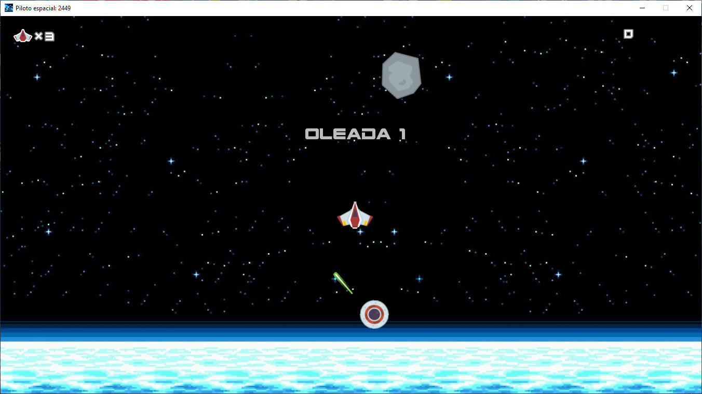
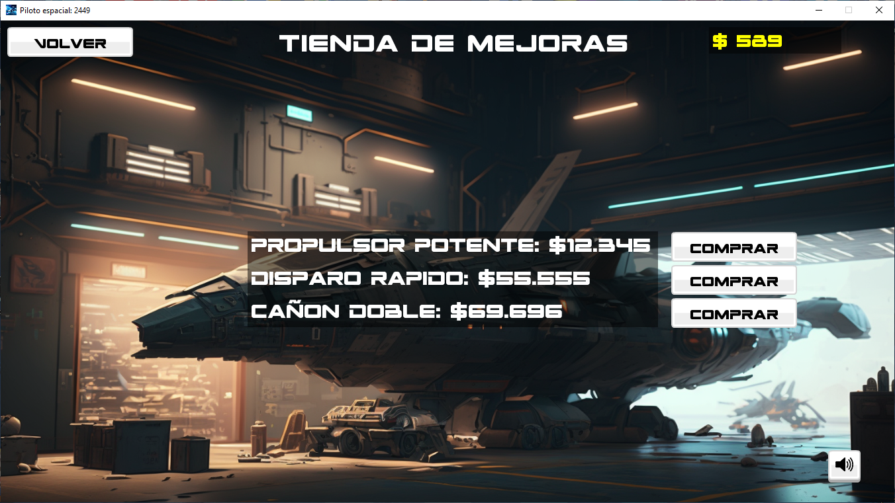

# Documentation

Index:

1. Introduction.
2. Controls, graphics, and music.
3. Ambience and story.
4. Game details.
   * Player.
   * Meteorites.
   * Enemies.
   * Weapons.
   * Upgrade store.
5. Additional information.
6. Screenshots.

___

## 1. Introduction

Title: Space Pilot 2449.

Designer: Juan Manuel Amores (Dingo) in indirect collaboration with Joshua Hernandez.

Synopsis: Protecting Earth in Space Pilot 2449

  In "Space Pilot 2449", you are a highly skilled pilot who has been hired by the global government of Earth to protect the planet from space threats. On board your highly technological ship, you will face a variety of dangers, including the destruction of meteorites and the fight against enemy ships that threaten the security of Earth.

  In each successful wave, you will receive a reward in the form of money, which you can use to upgrade and customize your ship. With a wide selection of weapons and defense systems, you can adapt your ship to your needs and combat strategies.

  You will face greater and more difficult challenges in each wave. Can you protect Earth and become the most respected and feared pilot in the universe? Prove it in "Space Pilot 2449"!.

About the game: This offers a constantly improving experience through its online store, where you can increase the capabilities of your space ship through the money earned from destroying meteorites, enemy ships, and collecting bonuses that appear randomly in the game. Get ready to enjoy an adventure full of challenges and rewards!

___

## 2. Controls, graphics, and music

The intuitive controls allow you to maneuver your ship with precision while exploring Earth's orbit. You can move with the up, right, left arrow keys and shoot with the space bar.

The graphics combine a semi-realistic futuristic aesthetic with cartoon and pixel art elements, creating a dynamic and attractive space environment. The life and accumulated money counter appear in the top left corner and bottom right corner of the screen, respectively, and informative messages keep you informed of your progress in real time.

The futuristic synthwave music fits perfectly into the cosmic universe of the game, with cheerful, mysterious, and vibrant melodies. The songs were selected from the royalty-free White Bat Audio and Spatial Schokolade - Topic channels, complementing the gaming experience at all times.

___

## 3. Ambience and story

The game is currently set very far in the future, more precisely in the year 2449, but it's a good idea to go back a little in history to know what happened:

  Humanity has never been closer to disaster than on that fateful day when Wisdom & Progress, the first star class corvette, collapsed under the weight of a meteorite rain. However, from the ashes of that tragic incident was born the Aegis Initiative, a group of elite pilots tasked with protecting the terrestrial air space and ensuring a safe future for humanity.

  Now it's your turn to join the ranks of the heroes of the Aegis. With cutting-edge technology and an unwavering spirit, you'll face the most dangerous threats to Earth and ensure its future. But be warned, the universe is a treacherous place and you'll need all your skill and cunning to survive.

___

## 4. Game details

**The player**: As a player, you start with 3 lives and control your spaceship to navigate through space with freedom. You will face meteors and enemies, and your task will be to avoid and hit them with your powerful equipped laser weapon. As you progress, you can upgrade your spaceship's capabilities and increase the effectiveness of your weapons, such as the shooting speed.

**Meteors**: Meteors are floating obstacles in space, with a grayish color. As a player, you must destroy them completely to advance to the next round. When shooting them, the meteors will split into smaller fragments until only a micro meteor is left, which will finally be destroyed by the laser when it is reached.

**Enemies**:

* UFO: The UFOs are circular enemy spaceships that appear in each round in greater numbers. They often call for reinforcements periodically and appear randomly in any part of the screen. Be careful, as these shoot powerful laser beams that can take away your lives. It is necessary to dodge and hit with precision to destroy them and obtain your reward.

* WarMachine: The WarMachine are powerful war spaceships that make their appearance immediately after destroying the last meteor. Get ready to face these powerful space war machines before they head towards Earth and receive a penalty!.

**Weapons**: You have a powerful ruby red laser cannon that can be upgraded to a double laser cannon and also faster cannons.

**Upgrade shop**: Upon returning to earth with the money raised from your expeditions in the earth's orbit, you can spend it on upgrades for your spaceship that will allow you to complete the waves more easily and reach further in your adventures.

___

## 5. Additional information

Genre: Arcade, action, space, science fiction.

Platform: PC.

Version: Beta 1.0

License: GPL.

Technology: Programmed in Java.

Audience: Casual.

Project start date: 12/27/2022

Demo release: 02/09/2023.

This documentation was semi-generated by an AI and with the supervision of the developer in charge of the video game.

## Screenshots

**Main menu:**

**Gameplay: wave 1**

**Upgrade shop:**

