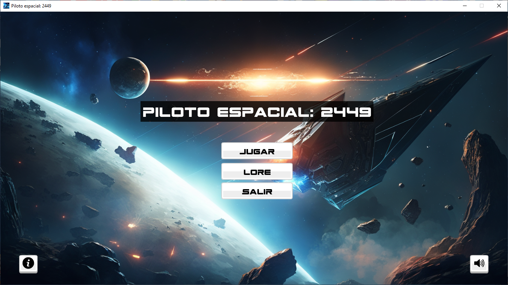
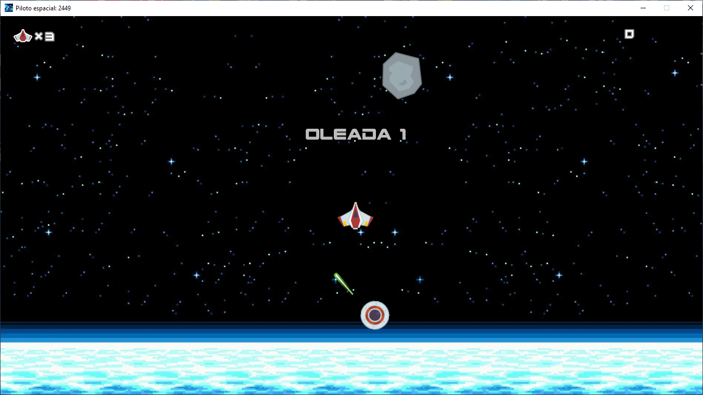
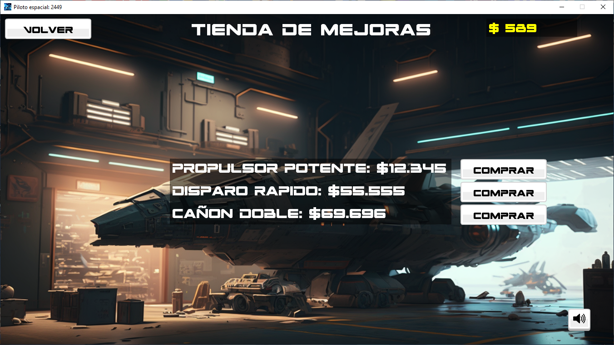

# Documentación

Indice:

1. Introducción.
2. Controles, gráficos y música.
3. Ambientación e historia.
4. Detalles del juego.
    * Jugador.
    * Meteoritos.
    * Enemigos.
    * Armas.
    * Tienda de mejoras.
5. Informacion complementaria.
6. Capturas de pantalla.

___

## 1. Introducción

Título: Piloto Espacial 2449.

Diseñador: Juan Manuel Amores (Dingo) en colaboración indirecta de Joshua Hernandez.

Sinopsis: Protegiendo la Tierra en Piloto Espacial 2449

    En "Piloto Espacial 2449", eres un piloto altamente capacitado que ha sido contratado por el gobierno mundial de la Tierra para proteger el planeta de las amenazas del espacio. A bordo de tu nave altamente tecnológica, deberás enfrentarte a una variedad de peligros, incluyendo la destrucción de meteoritos y la lucha contra naves enemigas que amenazan la seguridad de la Tierra.

    En cada oleada existosa, irás recibiendo una recompensa en forma de dinero, que podrás usar para mejorar y personalizar tu nave. Con una amplia selección de armas y sistemas de defensa, podrás adaptar tu nave a tus necesidades y estrategias de combate.

    Te enfrentarás a mayores y más dificiles desafíos en cada oleada. ¿Podrás proteger la Tierra y convertirte en el piloto más respetado y temido del universo? ¡Demuéstralo en "Piloto Espacial 2449"!.

Sobre el juego: Éste ofrece una experiencia de mejora constante a través de su tienda en línea, donde podrás aumentar las capacidades de tu nave espacial mediante el dinero ganado por la destrucción de meteoritos, naves enemigas y la recolección de bonus que aparecen de forma aleatoria en el juego. ¡Prepárate para disfrutar de una aventura llena de desafíos y recompensas!
___

## 2. Controles, gráficos y música

Los controles intuitivos te permiten maniobrar tu nave con precisión mientras exploras la órbita terrestre. Puedes moverte con las teclas de flecha hacia arriba, derecha, izquierda y disparar con la barra espaciadora.

Los gráficos combinan una estética futurista semi-realista con elementos de cartoon y pixel art, creando un ambiente espacial dinámico y atractivo. El contador de vidas y de dinero acumulado aparece en la esquina superior izquierda e inferior derecha de la pantalla, respectivamente, y mensajes informativos te mantienen al tanto de tus progresos en tiempo real.

La música synthwave futurista se adapta perfectamente al universo cósmico del juego, con melodías alegres, misteriosas y vibrantes. Las canciones fueron seleccionadas de los canales royalty free White Bat Audio y Spatial Schokolade - Topic, complementando la experiencia de juego en todo momento.

___

## 3. Ambientación e historia

El juego está actualmente ambientado muy en el futuro más precisamente en el año 2449, pero es buena idea remontarse un poco en la historia para saber que sucedió:

    La Humanidad nunca ha estado tan cerca del desastre como aquel fatídico día en el que la Wisdom&Progress, la primera corbeta de clase estelar, colapsó bajo el peso de una lluvia de meteoritos. Sin embargo, de la ceniza de aquel trágico incidente nació la Iniciativa Égida, un grupo de pilotos de élite encargados de proteger el espacio aéreo terrestre y garantizar un futuro seguro para la humanidad.

    Ahora, te toca a tí unirte a las filas de los héroes de la Égida. Con tecnología de vanguardia y un espíritu indomable, estás preparado para defender la Tierra y sus colonias contra todas las amenazas que acechan en el espacio. Desde tu cockpit, mirarás hacia el horizonte estelar y sabrás que tienes el poder de proteger a la humanidad de cualquier peligro que se presente.

    No es una tarea fácil, pero tú estás dispuesto a asumirla. ¿Estás listo para convertirte en el piloto más valiente y respetado del universo? Demuestra tu valentía en la Iniciativa Égida y defiende la Tierra contra todo lo que se le interponga en el camino. ¡Nada que venga del exterior detendrá el avance de quienes salen de ella!

___

## 4. Detalles del juego

**El jugador**: Como jugador, comienzas con 3 vidas y controlas tu nave para navegar por el espacio con libertad. Enfrentarás meteoritos y enemigos, y tendrás la tarea de evadirlos y acertarlos con tu potente arma láser equipada. A medida que avanzas, podrás mejorar las capacidades de tu nave y aumentar la efectividad de tus armas, como la velocidad de disparo.

**Meteoritos**: Los meteoritos son obstáculos flotantes en el espacio, con un color grisáceo. Como jugador, debes destruirlos por completo para avanzar a la siguiente ronda. Al dispararles, los meteoritos se dividirán en fragmentos más pequeños hasta que solo quede un micro meteorito, que finalmente será destruido por el láser al ser alcanzado.

**Enemigos**:

* UFO: Los OVNIS son naves enemigas circulares que aparecen en cada ronda en mayor cantidad. A menudo llaman refuerzos periódicamente y aparecen de forma aleatoria en cualquier parte de la pantalla. Debes tener cuidado, ya que estos disparan potentes rayos láser que pueden quitarte vidas. Es necesario esquivarlos y acertar con precisión para destruirlos y obtener tu recompensa."
  
* WarMachine: Las WarMachine son naves de guerra poderosas que hacen su aparición inmediatamente después de destruir el último meteorito. Prepárate para enfrentarte a estas poderosas máquinas de guerra espaciales antes de que se dirijan hacia la Tierra y recibas una penalización!.

**Armas**: Dispones de un poderoso cañón láser rojo rubí que puede ser mejorado a un doble cañón láser y también a cañones más rápidos.

**Tienda de mejoras**: Al regresar a la tierra con el dinero recaudado en tus expediciones en la órbita terrestre, podrás gastarlo en mejoras para tu nave que te permitirán completar las oleadas con mayor facilidad y llegar más lejos en tus aventuras.

___

## 5. Informacion complementaria

Género: Arcade, acción, espacial, ciencia ficción.

Plataforma: PC.

Versión: Beta 1.0

Licencia: GPL.

Tecnología: Programado en Java.

Público: Casual.

Fecha de inicio del proyecto: 27/12/2022

Publicación de la demo: 9/02/2023.

Esta documentación fue semi-generado por una IA y con supervisión del desarrollador a cargo del videojuego.

## Capturas de pantalla

**Menu principal:**

**Gameplay: oleada 1**

**Tienda de mejoras:**

